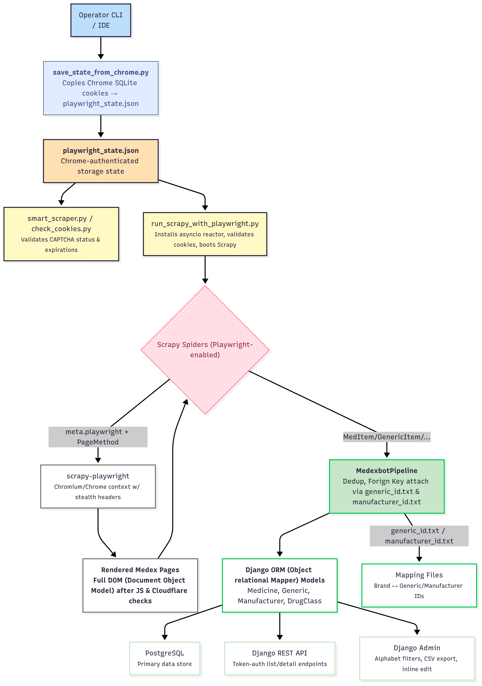
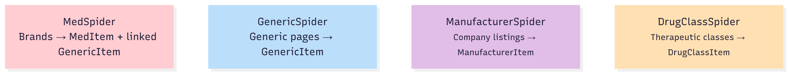

# Bangladesh Medicine Scraper

Scrapes public pharmaceutical catalogue data from [medex.com.bd](https://medex.com.bd) using **Scrapy + Playwright**, then saves it to **PostgreSQL** through a **Django** project (with a simple **Django REST Framework** API on top).


## What This Project Does (in 30 seconds)

- Crawls MedEx listing pages (companies, generics, brands/medicines, drug classes).
- Uses a real browser session (Playwright + Chrome) and **reuses your cookies** from `playwright_state.json` to reduce anti-bot challenges.
- Extracts structured data into Django models and stores them in Postgres.
- Exposes a token-authenticated REST API so you can query the stored data.

> Note on “CAPTCHA bypass”: this repo does not “solve” CAPTCHAs automatically. It **reuses an already verified browser session** (cookies) so the site is less likely to show a challenge. If you see a CAPTCHA, refresh the session cookies and try again.

> Privacy note: `playwright_state.json` contains session cookies. Treat it like a password. Use your own local copy and avoid committing real cookies back to git.

## Who This README Is For

- **Absolute beginners**: follow “Quick Start” and read “Concepts” to understand what’s happening.
- **Developers**: jump to “Internal Deep Dive” to see where Playwright hooks into Scrapy and how data is persisted.

## Concepts: Scrapy vs Playwright (Basics)

### What is Scrapy?

Scrapy is a Python framework for building crawlers:

- You write a **spider** that starts from one or more URLs.
- Scrapy downloads each page and calls your `parse()` functions.
- Your code extracts data and yields **items** (structured objects).
- Items go through **pipelines** (e.g., save to database, deduplicate, export).

In this repo, Scrapy is responsible for:

- “Visit all pages” (pagination + following detail links).
- “Extract fields from HTML”.
- “Send extracted objects to the database pipeline”.

### What is Playwright?

Playwright is a browser automation tool:

- It runs a real browser engine (Chrome/Chromium/etc.).
- It can execute JavaScript, wait for dynamic content, and maintain cookies/session.
- It’s useful when websites block plain HTTP bots or heavily depend on JS rendering.

In this repo, Playwright is used to:

- Fetch pages through a **real browser context**.
- Load cookies from `playwright_state.json` so requests look like a real, previously-verified user session.
- Wait for pages to fully load before Scrapy parses them.

### What does “Scrapy + Playwright scraper” mean?

Scrapy is the “crawler brain” and parsing engine, but for selected requests it delegates the actual downloading to Playwright.

Concretely, spider requests include:

- `meta["playwright"] = True` so Scrapy uses the Playwright downloader
- `playwright_page_methods` like `wait_for_load_state("networkidle")` so the page is ready before parsing

See examples in `medexbot/spiders/manufacturer_spider.py` and `medexbot/spiders/generic_spider.py`.

## Project Structure (What lives where)

```
Bangladesh_Medicine_Scraper/
├── core/                         # Django settings + root URLs
├── crawler/                      # Django models + admin + management commands
├── api/                          # DRF serializers + views + routes
├── medexbot/                     # Scrapy project (settings, spiders, pipeline)
├── run_scrapy_with_playwright.py # Runs spiders with Chrome cookies via Playwright
├── save_state_from_chrome.py     # Creates/updates playwright_state.json (cookie export)
├── smart_scraper.py              # Checks whether current cookies still avoid CAPTCHA
├── playwright_state.json         # Your exported session cookies (do not commit your real one)
├── scrapy.cfg
└── requirements.txt
```

## Quick Start (Beginner-Friendly)

### Prerequisites

- Python 3.10+
- PostgreSQL
- Google Chrome installed

### 1) Create a virtual environment + install dependencies

```bash
python -m venv .venv

# Windows:
.venv\Scripts\activate
# macOS/Linux:
source .venv/bin/activate

pip install -r requirements.txt

# Playwright needs browser binaries too:
playwright install
```

### 2) Create and configure Postgres + `.env`

Create DB + user (example):

```bash
psql -U postgres

CREATE DATABASE bd_medicine_scraper;
CREATE USER medicine_user WITH PASSWORD 'your_secure_password';
GRANT ALL PRIVILEGES ON DATABASE bd_medicine_scraper TO medicine_user;
\q
```

Create `.env` in project root:

```bash
DB_NAME=bd_medicine_scraper
DB_USERNAME=medicine_user
DB_PASSWORD=your_secure_password
DB_HOST=localhost
DB_PORT=5432

SECRET_KEY=your-secret-key-here
DEBUG=True
```

### 3) Run migrations + start Django

```bash
python manage.py migrate
python manage.py createsuperuser
python manage.py runserver
```

Open:

- Admin: http://127.0.0.1:8000/admin/

### 4) Create/refresh the Chrome session cookies (`playwright_state.json`)

The scraper expects your MedEx cookies in `playwright_state.json`.

Option A (scripted export; Windows-style profile lookup):

```bash
python save_state_from_chrome.py
```

Option B (manual, works on any OS):

1. Open Chrome → go to `https://medex.com.bd/companies?page=1`
2. If a CAPTCHA appears, solve it once
3. Press `F12` → **Application** → **Cookies** → `https://medex.com.bd`
4. Export/copy cookie values into `playwright_state.json` (Playwright “storage state” format)

### 5) Run spiders (scrape data into the database)

```bash
# Recommended order:
python run_scrapy_with_playwright.py manufacturer
python run_scrapy_with_playwright.py drug_class
python run_scrapy_with_playwright.py generic
python run_scrapy_with_playwright.py med
```

Optional: a “no browser” mode exists for the generic spider, but it will only work when the site does not require CAPTCHA/challenges:

```bash
python run_generic_direct.py
```

If you want to quickly check if your cookies are still valid:

```bash
python smart_scraper.py --validate
```

## Output: Database, Admin, API

### Django Admin (quickest way to see results)

Go to http://127.0.0.1:8000/admin/ and browse:

- Manufacturers
- Generics
- Medicines (brands)
- Drug classes

### REST API (Token Auth)

1) Create a token:

- Endpoint: `POST /api-token-auth/` (see `core/urls.py`)

Example with curl:

```bash
curl -X POST http://127.0.0.1:8000/api-token-auth/ \
  -H "Content-Type: application/json" \
  -d '{"username":"YOUR_USER","password":"YOUR_PASS"}'
```

2) Call API endpoints with the token:

```bash
curl http://127.0.0.1:8000/api/medicines/ \
  -H "Authorization: Token YOUR_TOKEN"
```

API routes are defined in `api/urls.py`, and implemented using DRF generic views in `api/views.py`.

### Export to CSV (optional)

There is a management command you can use to export a model to CSV:

```bash
python manage.py export_csv medicine /tmp/medicine_export
python manage.py export_csv generic /tmp/generic_export
python manage.py export_csv manufacturer /tmp/manufacturer_export
```

See `crawler/management/commands/export_csv.py`.

## How It Works (System Overview)

At a high level:

1. You provide a verified MedEx session (cookies) → `playwright_state.json`
2. Spiders send requests with `meta["playwright"]=True` so Scrapy downloads them via Playwright
3. Spiders parse HTML and yield “items”
4. The Scrapy pipeline converts items into Django model rows and saves them to Postgres
5. Django Admin + DRF API read the same database tables

## Architecture Diagrams (Optional)





## Internal Deep Dive (Developer-Focused)

### 1) Scrapy → Playwright integration

Playwright is wired into Scrapy via `scrapy-playwright` settings in `medexbot/settings.py`:

- `DOWNLOAD_HANDLERS` routes `http/https` downloads to `ScrapyPlaywrightDownloadHandler`
- `PLAYWRIGHT_CONTEXTS["default"]["storage_state"]` points to `playwright_state.json`

Spiders opt-in per request by setting request meta (example pattern):

- `meta["playwright"] = True`
- `meta["playwright_context"] = "default"`
- `meta["playwright_page_methods"] = [PageMethod("wait_for_load_state", "networkidle"), ...]`

This is why you get “browser-rendered HTML” inside Scrapy’s `response`.

### 2) The runner script and Twisted/asyncio

`run_scrapy_with_playwright.py` installs an asyncio-compatible Twisted reactor before importing Scrapy/Django.
This matters because Playwright is async and `scrapy-playwright` expects the Asyncio reactor to be installed early.

### 3) Spiders (what they extract)

- `ManufacturerSpider` (`medexbot/spiders/manufacturer_spider.py`)
  - Starts at `/companies?page=1`
  - Parses company rows and paginates
- `DrugClassSpider` (`medexbot/spiders/drug_class_spider.py`)
  - Starts at `/drug-classes`
  - Follows each drug class page and counts linked generics
- `GenericSpider` (`medexbot/spiders/generic_spider.py`)
  - Starts at `/generics?page=1`
  - Follows each generic page and extracts monograph/description sections
- `MedSpider` (`medexbot/spiders/med_spider.py`)
  - Crawls `/brands...` pages
  - Extracts medicine/brand data
  - Writes mapping hints to `manufacturer_id.txt` and `generic_id.txt` to attach relations later

All spiders include a basic “challenge page” check (look for `captcha` / `challenge`) and stop early if a challenge is detected.

### 4) Items and the database pipeline

Items are Django-backed via `scrapy-djangoitem` (see `medexbot/items.py`), so an item can be saved directly into the corresponding Django model.

`MedexbotPipeline` (`medexbot/pipelines.py`) does the persistence:

- Routes items by type (medicine vs generic vs manufacturer vs drug class).
- Avoids duplicates by checking the unique ID field first (`brand_id`, `generic_id`, etc.).
- For medicines, tries to attach `Generic` and `Manufacturer` foreign keys using mapping files:
  - `generic_id.txt` (brand_id → generic_id)
  - `manufacturer_id.txt` (brand_id → manufacturer_id)
  - If a Generic is missing, it can create a lightweight placeholder row and fill it later when the real Generic item arrives.

This mapping approach is used because the medicine page often contains only “links” to generic/manufacturer pages, not full objects.

### 5) Django REST Framework API

The DRF API provides read-only list/detail views (token-authenticated) for:

- Medicines
- Generics
- Manufacturers
- Drug classes

Routes: `api/urls.py`  
Views: `api/views.py`  
Serializers: `api/serializers.py`

## Troubleshooting

### “CAPTCHA detected” / “challenge page”

- Re-check your session: `python smart_scraper.py --validate`
- Refresh cookies: regenerate `playwright_state.json` (solve CAPTCHA once in Chrome, then export cookies again)
- Try again with a slower crawl (lower concurrency/delay) if needed

### Playwright errors (browser not installed)

After `pip install -r requirements.txt`, you still need:

```bash
playwright install
```

### Database connection errors

- Confirm Postgres is running
- Confirm `.env` values match your DB/user/password
- Verify with:

```bash
psql -U medicine_user -d bd_medicine_scraper -h localhost
```

## Contributing

1. Fork the repo
2. Create a feature branch
3. Test your changes
4. Open a PR
