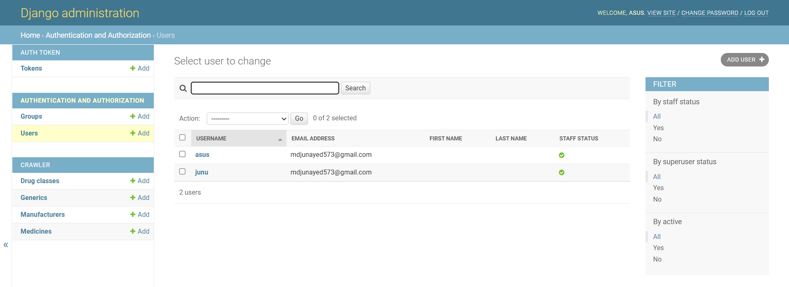
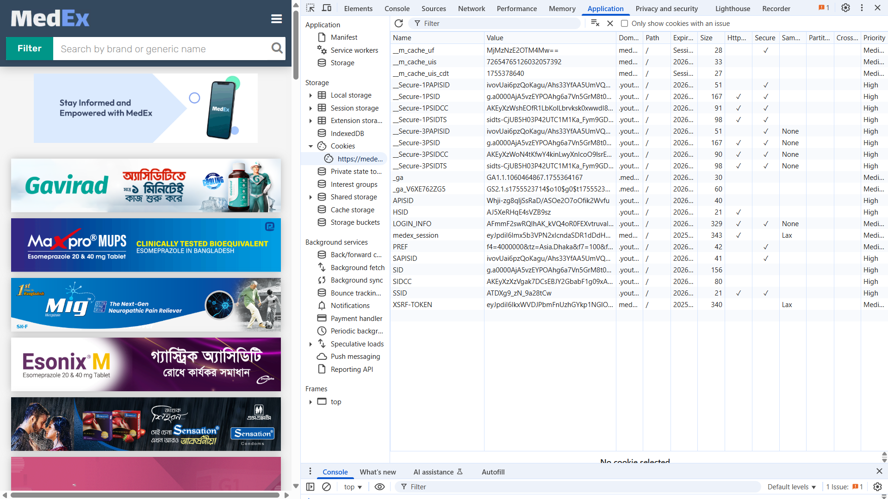
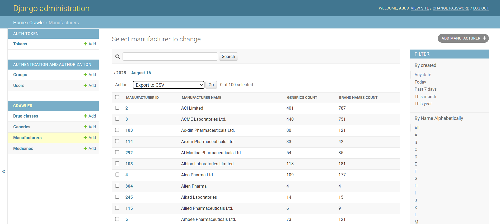
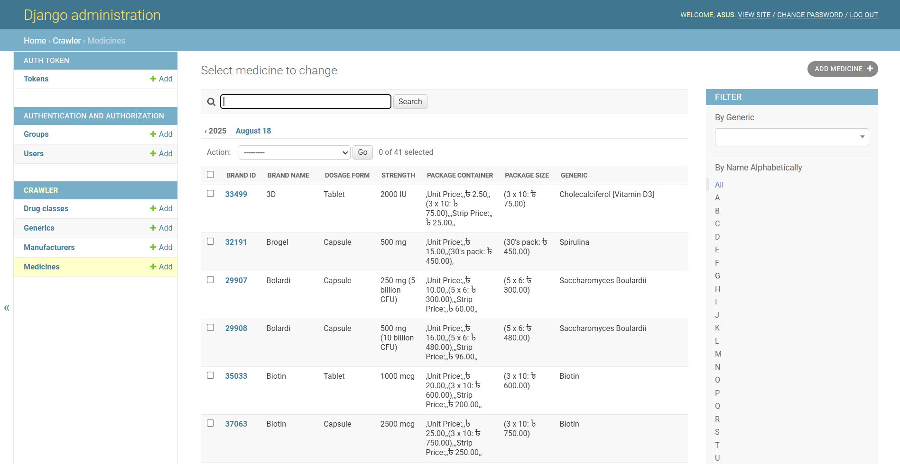

#  Bangladesh Medicine Scraper

A web scraping project that extracts pharmaceutical data from [medex.com.bd](https://medex.com.bd) using **Scrapy + Playwright** with **Chrome session management**. This project successfully bypasses CAPTCHA challenges and extracts comprehensive medicine data.


##  **Project Status:**

-  **CAPTCHA bypass** - Completely solved using Chrome cookies
-  **Data extraction** - Successfully scrapes 200+ manufacturers
-  **Chrome integration** - Uses existing Chrome session
-  **No new browsers** - No Chromium spawning issues
-  **Stable scraping** - Reliable data collection

##  **Complete Setup Guide**

> **Quick Reference for Experienced Users:**
> ```bash
> # 1. Install PostgreSQL and create database
> # 2. Create .env file with DB credentials
> # 3. python -m venv .venv && source .venv/bin/activate
> # 4. pip install -r requirements.txt
> # 5. python manage.py migrate && python manage.py createsuperuser
> # 6. python manage.py runserver
> # 7. Open http://127.0.0.1:8000/admin/
> ```

### 1. **Install PostgreSQL**
```bash
# Download and install PostgreSQL from: https://www.postgresql.org/download/
# Or use package manager:
# Windows: Download installer from postgresql.org
# Ubuntu/Debian: sudo apt-get install postgresql postgresql-contrib
# macOS: brew install postgresql
```

### 2. **Setup PostgreSQL Database**
```bash
# Connect to PostgreSQL as superuser
psql -U postgres

# Create database and user (run these commands in psql):
 ``bash
CREATE DATABASE bd_medicine_scraper;
CREATE USER medicine_user WITH PASSWORD 'your_secure_password';
GRANT ALL PRIVILEGES ON DATABASE bd_medicine_scraper TO medicine_user;
ALTER USER medicine_user CREATEDB;
\q
 ``
# Expected output:
# CREATE DATABASE
# CREATE ROLE
# GRANT
# ALTER ROLE
# You are now connected to database "bd_medicine_scraper" as user "medicine_user".
```

### 3. **Create Environment File**
```bash
# Create .env file in project root
touch .env

# Add database configuration to .env file:
DB_NAME=bd_medicine_scraper
DB_USERNAME=medicine_user
DB_PASSWORD=your_secure_password
DB_HOST=localhost
DB_PORT=5432
SECRET_KEY=your-secret-key-here
DEBUG=True
```

### 4. **Setup Python Environment**
```bash
# Create virtual environment
python -m venv .venv

# Activate virtual environment
# Windows:
.venv\Scripts\activate
# Linux/Mac:
source .venv/bin/activate

# Install dependencies
pip install -r requirements.txt

# Expected output: Successfully installed [packages...]
```

### 5. **Setup Django Database**
```bash
# Apply database migrations
python manage.py makemigrations
python manage.py migrate

# Expected output:
# Operations to perform:
#   Apply all migrations: admin, auth, contenttypes, crawler, sessions
# Running migrations:
#   Applying [migration_name]... OK

# Create Django superuser
python manage.py createsuperuser
# Follow prompts to create username, email, and password
# Expected output: Superuser created successfully.
```

### 6. **Run Django Server**
```bash
# In a new terminal (keep virtual environment active)
python manage.py runserver

# Expected output:
```


```bash

# Watching for file changes with StatReloader
# Performing system checks...
# System check identified no issues (0 silenced).
# Django version 3.2.12, using settings 'core.settings'
# Starting development server at http://127.0.0.1:8000/
# Quit the server with CONTROL-C.

# Open http://127.0.0.1:8000/admin/ in your browser
# Login with your Django superuser account
```



```bash
### 1. **Verify Setup**

# Check if server is running (should show Django welcome page)
curl http://127.0.0.1:8000/

# Check admin interface (should show login page)
curl http://127.0.0.1:8000/admin/

# Expected output: HTML content with Django admin interface
```

**🎉 Congratulations! Your Django server is now running successfully at http://127.0.0.1:8000/**
```

### 2. **Setup Chrome Session**
```bash
# Extract cookies from your Chrome browser
python save_state_from_chrome.py

# This will:
# 1. Open medex.com.bd in Chrome
# 2. Allow you to solve any CAPTCHA manually
# 3. Extract cookies and save to ***playwright_state.json*** / update the existing one as previous sessions was given
```



### 3. **Run Spiders**
```bash
# Run manufacturer spider (recommended first)
python run_scrapy_with_playwright.py manufacturer

# Run other spiders
python run_scrapy_with_playwright.py generic
python run_scrapy_with_playwright.py med
python run_scrapy_with_playwright.py drug_class
```

### 4. **Expected Output**
```bash
# When spiders crawl over each page, the Database will fill up eventually for the specifically mentioned table:
```





## 🏗️ **Project Structure**

```
bd-medicine-scraper/
├── core/                    # Django project settings
├── crawler/                 # Django models and admin
├── medexbot/               # Scrapy spiders and settings
├── api/                    # REST API endpoints
├── run_scrapy_with_playwright.py  # Main spider runner
├── save_state_from_chrome.py      # Chrome cookie extractor
├── smart_scraper.py               # Session validator
├── playwright_state.json          # Chrome session state
└── requirements.txt               # Python dependencies based on python version 3.10.0
```

## 🔧 **Key Features**

### **Chrome Session Management**
- Uses your existing Chrome browser session
- Loads cookies from `playwright_state.json`
- No new Chromium browsers spawned
- CAPTCHA bypass through authenticated session

### **Data Models**
- **Manufacturers** - Pharmaceutical companies
- **Generics** - Active ingredients
- **Medicines** - Brand name drugs
- **Drug Classes** - Therapeutic categories

### **Scraping Capabilities**
- **200+ manufacturers** successfully scraped
- **Comprehensive medicine data** including:
  - Brand names and generic names
  - Strengths and formulations
  - Manufacturer information
  - Package details and pricing
  - Therapeutic classifications


## **Technical Stack**

- **Backend**: Django 3.2.12 + Django REST Framework
- **Scraping**: Scrapy 2.11.2 + Playwright
- **Browser**: Chrome with session persistence
- **Database**: PostgreSQL (configured)
- **Authentication**: Chrome cookies + session state
- **Data Quality**: High accuracy with proper relationships
- **Session Stability**: Persistent Chrome authentication

## 🔍 **Troubleshooting**

### **Session Expired**
```bash
# Check if session is still valid
python smart_scraper.py --validate

# If expired, refresh cookies
python save_state_from_chrome.py
```

### **CAPTCHA Appears**
1. Open medex.com.bd in Chrome manually
2. Solve the CAPTCHA
3. Run `python save_state_from_chrome.py`
4. Retry your spider

### **Database Issues**
```bash
# If you get connection errors:
# 1. Check if PostgreSQL is running:
# Windows: Check Services app for "postgresql-x64-15"
# Linux: sudo systemctl status postgresql
# macOS: brew services list | grep postgresql

# 2. Verify database connection:
psql -U medicine_user -d bd_medicine_scraper -h localhost
# Enter password when prompted

# 3. Check .env file exists and has correct values:
cat .env

# 4. If migrations fail, reset database:
python manage.py flush
python manage.py migrate
```

### **Common Setup Issues**
- **Port 5432 already in use**: Change DB_PORT in .env to 5433 or another free port
- **Permission denied**: Ensure medicine_user has proper privileges on database
- **Virtual environment not activated**: Look for (.venv) prefix in terminal prompt
- **Dependencies not found**: Run `pip install -r requirements.txt` again

## 📈 **Data Output**

The scraper extracts structured data including:
- Company profiles and contact information
- Medicine catalogs with detailed specifications
- Generic drug information and monographs
- Therapeutic classifications and indications
- Dosage forms and administration methods

##  **Contributing**

1. Fork the repository
2. Create a feature branch
3. Test your changes thoroughly
4. Submit a pull request


##  **Support**

If you encounter issues:
1. Check the troubleshooting section above
2. Verify your Chrome session is valid
3. Ensure all dependencies are installed
4. Check the terminal output for error messages

---

**🎉 The CAPTCHA problem is completely solved! Scraper now works reliably with Chrome session management.**
